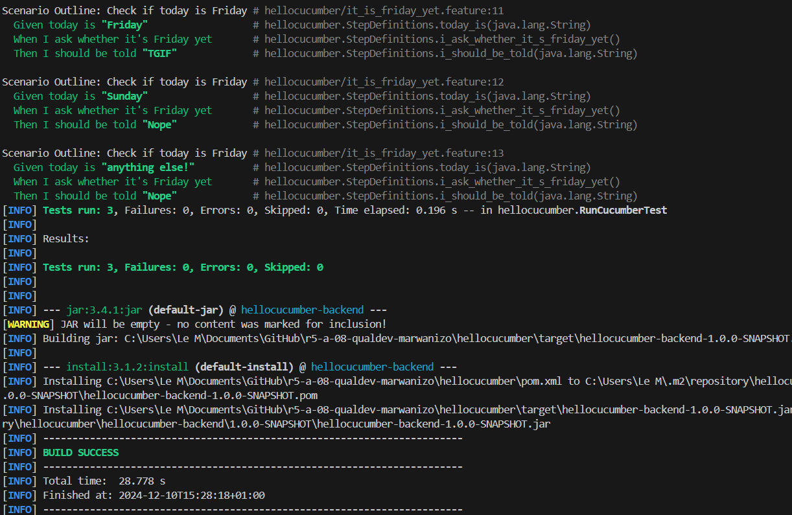

= R5.A.08 -- Dépôt pour les TPs
:icons: font
:MoSCoW: https://fr.wikipedia.org/wiki/M%C3%A9thode_MoSCoW[MoSCoW]

Ce dépôt concerne les rendus de mailto:marwan.almasri11@gmail.com[Marwan AL MASRI].
m
== TP1

.Tests
[source,java]
----
  @Given("today is {string}")
    public void today_is(String day) {
        today = day;
    }

    @When("I ask whether it's Friday yet")
    public void i_ask_whether_it_s_friday_yet() {
        answer = IsItFriday.isItFriday(today);
    }

    @Then("I should be told {string}")
    public void i_should_be_told(String expectedAnswer) {
        assertEquals(expectedAnswer, answer);
    }
----
.Feature
[source,java]
----
Feature: Is it Friday yet?
  Everybody wants to know when it's Friday

  Scenario Outline: Check if today is Friday
    Given today is "<day>"
    When I ask whether it's Friday yet
    Then I should be told "<answer>"

  Examples:
    | day            | answer |
    | Friday         | TGIF   |
    | Sunday         | Nope   |
    | anything else! | Nope   |

----

.Exemple d'image insérée en AsciiDoc

---
== TP2...
!